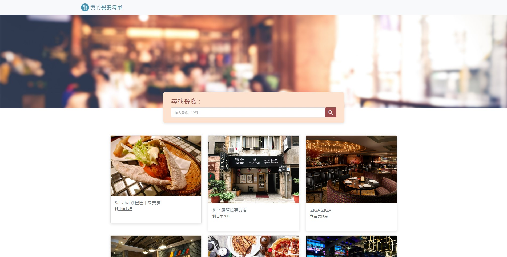
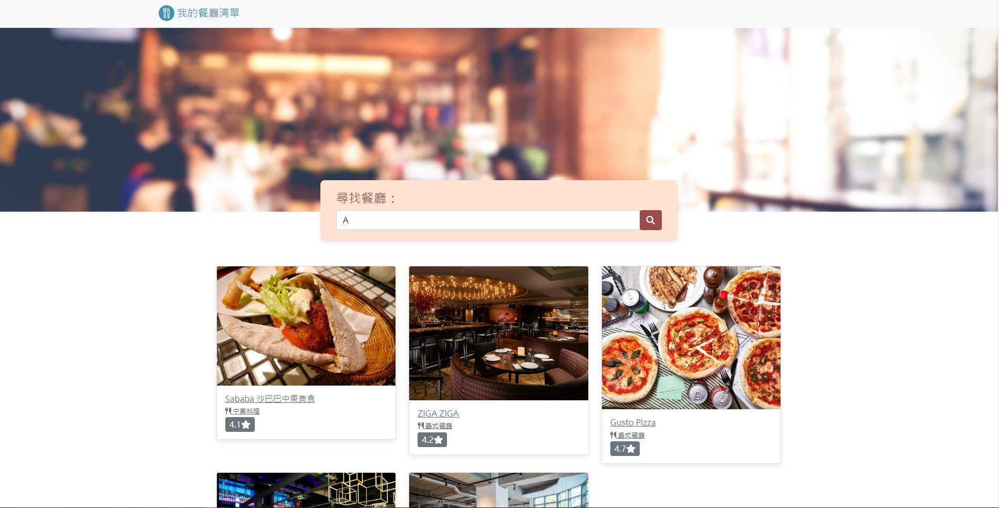

# 我的餐廳清單

利用Node.js與Express，搭配handlebars模板引擎使用。能夠瀏覽網站上的餐廳口袋名單並於點選後進入到詳細資訊的頁面。另外搭配搜尋功能可以從清單中找出符合關鍵字的特定餐廳。

## 產品照片

### 我的餐廳清單首頁


### 個別餐廳資訊頁面


### 搜索功能使用示意


## 產品功能

* 使用者可以瀏覽餐廳名單，從餐廳小卡得到餐廳名稱、餐廳種類與評分等資訊。
* 使用者可以透過典籍餐廳資訊小卡進入到詳細資料頁面。
* 使用者再詳細資料頁面除了名稱、類別外，可以進一步了解餐廳的地址，電話與介紹。
* 使用者可以利用搜尋欄位輸入關鍵字，從名單中找出符合資訊的餐廳名單。

### 環境建置

* Node.js @ 14.16.0
* Nodemon
* Express @ 4.16.4
* Express-Handlebars @ 3.0.0

### 安裝

1.開啟terminal, clone此專案至本機電腦

```
git clone https://github.com/shanyueel/restaurant_list.git
```

2.進入存放此專案的資料夾

```
cd restaurant_list
```

3.安裝npm套件

```
npm install
```

4.以node 開始運行 app.js

```
node app.js
```

5.使用瀏覽器開啟伺服器位置 http://localhost:3000/ 即能測試網頁效果

## 開發人員

* **Shanyueel** - [shanyueel](https://github.com/shanyueel)
